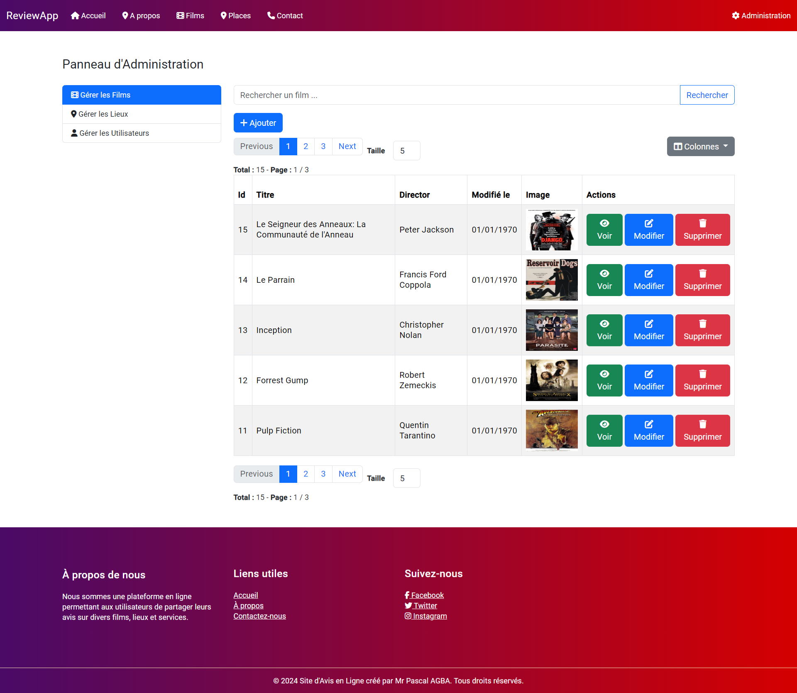
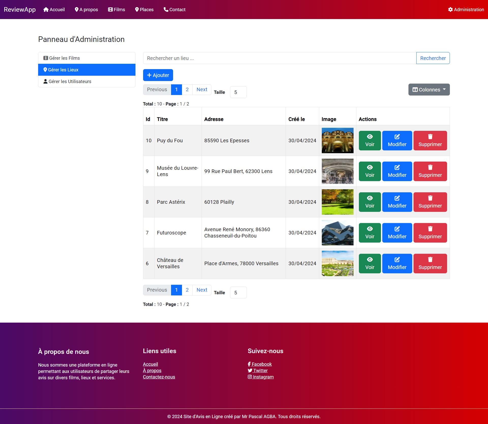
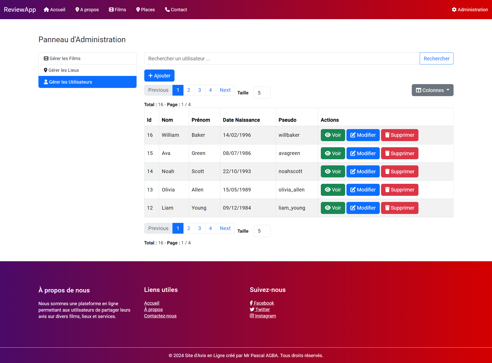
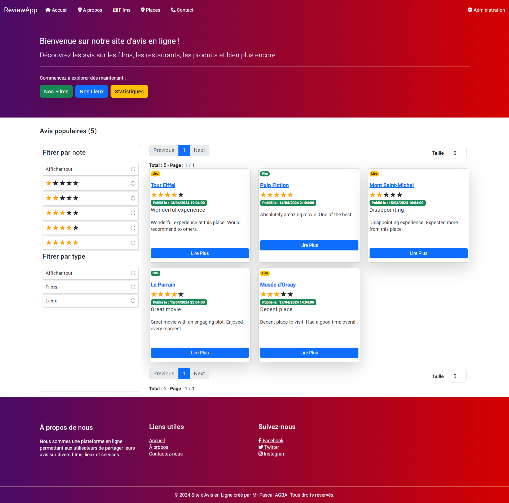
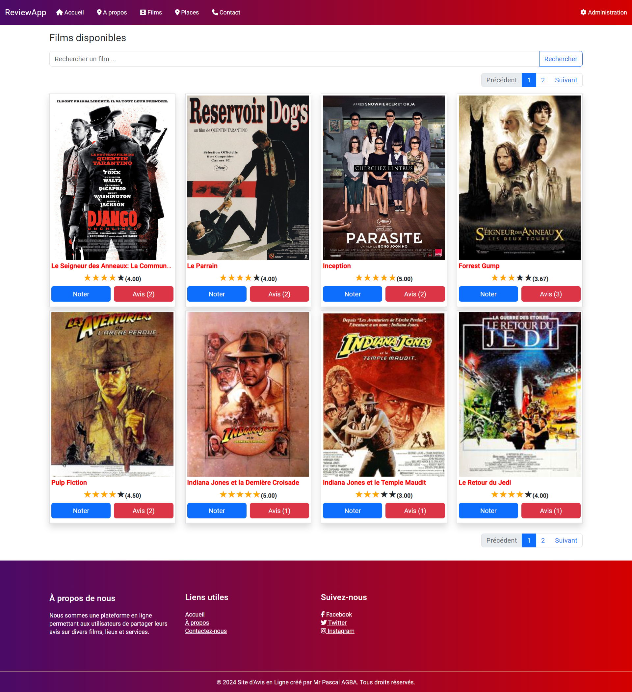
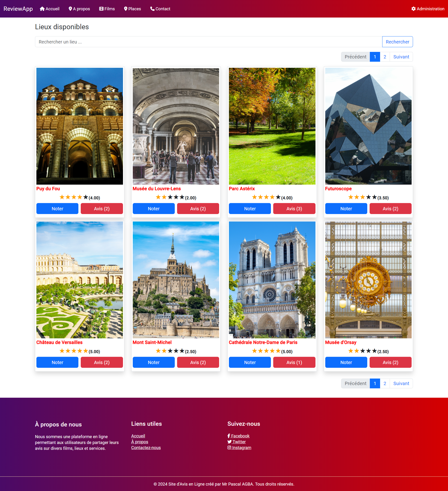
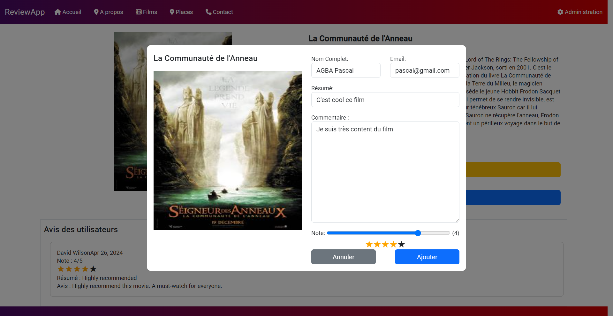

# README du Projet Site d'Avis

Ce README vise à fournir une documentation détaillée pour le projet "Site d'Avis et de review en ligne", qui a été développé par M. Pascal AGBA, M. Moussa KONE et M. Abdoulaye MBAYE en utilisant Angular pour le front-end et Spring Boot pour le back-end.

## Description du Projet

Le projet "Site d'Avis" permet aux utilisateurs de donner leurs avis sur diverses entités telles que des films, des bars, des restaurants ou d'autres lieux publics. Il comporte deux principales sections : une partie publique où les utilisateurs peuvent consulter et soumettre des avis, et un panneau d'administration permettant aux administrateurs de gérer les données du site.

## Fonctionnalités Principales

### Panneau d'Administration

L'administration est accessible sur la route `/admin`.

1. **Gestion des Films, utilisateurs et Lieux Publics :** Les administrateurs peuvent créer, éditer et supprimer des fiches de films ou de lieux publics. Pour les films, les informations incluent l'affiche, le nom, le réalisateur, le synopsis et la date de sortie. Pour les lieux, les informations incluent le titre, l'adresse et les horaires d'ouverture.

   - Route de gestion des films : `/admin/movies`
   
   - Route de gestion des lieux : `/admin/places`
   
   - Route de gestion des utilisateurs : `/admin/users`
   

### Partie Publique
1.**Page d'accueil :** La page d'accueil affiche la listes avis populaires.
   

2. **Affichage des Lieux/Films :** Les utilisateurs peuvent consulter la liste des lieux/films disponibles.

   - Route : `/entity/:model` (où `:model` peut être `movies` ou `places`)
   
   


3. **Avis Utilisateur :** Les utilisateurs peuvent soumettre leurs avis sur un lieu/film, comprenant une note, un résumé et éventuellement un avis détaillé.
   

### Bonus

Si les fonctionnalités principales sont complètes, voici quelques idées pour améliorer le site :

- Affichage d'un classement des meilleurs lieux/films basé sur la moyenne des notes des avis.
- Utilisation de graphiques pour visualiser les notes et les tendances.
- Amélioration de l'esthétique du site avec un design attrayant.
- Mise en place de notifications par e-mail pour encourager les utilisateurs à laisser des avis après plusieurs visites.

## Technologies Utilisées

- Front-end : Angular 17
- Back-end : Spring Boot

## Installation et Exécution

1. Cloner le repository du projet.
2. Assurez-vous d'avoir Angular et Spring Boot installés localement.
3. Pour exécuter le front-end :
   ```
   cd chemin/vers/le/dossier/front-end
   ng install
   ng serve
   ```
4. Pour exécuter la base de données dans docker :
   ```
   cd chemin/vers/le/dossier/back-end
   docker-compose up
   ```
5. Pour exécuter le back-end :
   ```
   cd chemin/vers/le/dossier/back-end
   mvn spring-boot:run
   ```

## Contributeurs

- M. Pascal AGBA
- M. Moussa KONE
- M. Abdoulaye MBAYE

## Licence


## Remarques Supplémentaires


